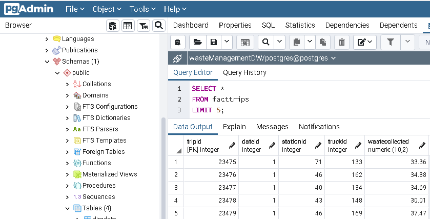
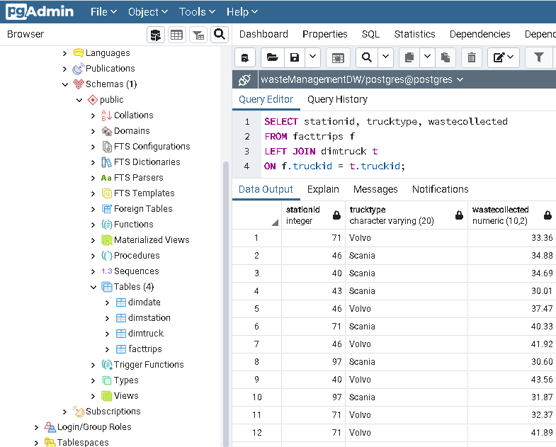

# Scenario
we are a data engineer hired by a solid waste management company. The company collects and recycles solid waste across major cities in the country of Brazil. The company operates hundreds of trucks of different types to collect and transport solid waste. The company would like to create a data warehouse so that it can create reports like

- total waste collected per year per city
- total waste collected per month per city
- total waste collected per quarter per city
- total waste collected per year per trucktype
- total waste collected per trucktype per city
- total waste collected per trucktype per station per city

# Objectives
- Design a Data Warehouse
- Load data into Data Warehouse
- Write aggregation queries
- Create MQTs
- Create a Dashboard

# 1 - Design a Data Warehouse
The solid waste management company has provied we the sample data they wish to collect.


we will start wer project by designing a Star Schema warehouse by identifying the columns for the various dimension and fact tables in the schema.

## Task 1 - Design the dimension table MyDimDate
The company is looking at a granularity of day. Which means they would like to have the ability to generate the report on yearly, monthly, daily, and weekday basis.

| **Field Name** | **Details**                                                                               |
|----------------|-------------------------------------------------------------------------------------------|
| _dateId_      | Primary Key Id of the MyDimDate table                                                               |
| _year_         | Year derived from the date field of the original data. Example 2020                       |
| _quarter_      | Quarter number derived from the date field of the original data.Example 1,2,3,4           |
| _quarterName_ | Quarter name derived from the date field of the original data. Example Q1,Q2              |
| _month_        | Month number derived from the date field of the original data. Example 1,2,3,etc          |
| _monthName_   | Month name derived from the date field of the original data. Example January,February,etc |
| _day_          | Day number derived from the date field of the original data. Example 1,2,3,etc            |
| _weekday_      | Number of days in 1 week. Example 1,2,3,etc                                               |
| _weekdayName_ | Name of days in 1 week start from monday. Example Monday,Tuesday                          |


## Task 2 - Design the dimension table MyDimWaste
| **Field Name** | **Details**                                 |
|----------------|---------------------------------------------|
| _wasteId_      | Primary Key Id of the MyDimWaste table           |
| _wasteType_    | Waste type name. Example Dry,Wet,etc |


## Task 3 - Design the dimension table MyDimZone

| **Field Name**   | **Details**                                                                                         |
|------------------|-----------------------------------------------------------------------------------------------------|
| _zoneId_         | Primary Key Id of the MyDimZone table                                                                    |
| _collectionZone_ | Collection zone derived from the collection zone field of the original data. Example West,South,etc |
| _city_           | City name derived from the city field of the original data. Example Sao Paulo, Rio de Jainero       |

## Task 4 - Design the fact table MyFactTrips

| **Field Name**   | **Details**                                                  |
|------------------|--------------------------------------------------------------|
| _tripId_         | Primary Key Id of the MyFactTrips Trip table                        |
| _dateId_         | Foreign Key references the dateId in the MyDimDate table       |
| _wasteId_      | Foreign Key references the wasteId in the MyDimWaste table |
| _zoneId_        | Foreign Key references the zoneId in the MyDimZone table     |
| _wasteCollected_ | Number of waste collected in tons. Example 1,1.45,etc        |


# 2 - Create schema for Data Warehouse on PostgreSQL
## Task 5 - Create the dimension table MyDimDate
```
CREATE TABLE MyDimDate (
   dateId SERIAL PRIMARY KEY,
   year INT,
   quarter INT,
   quarterName VARCHAR(2),
   month INT,
   monthName VARCHAR(9),
   day INT,
   weekday INT,
   weekdayName VARCHAR(9)
);
```
## Task 6 - Create the dimension table MyDimWaste
```
CREATE TABLE MyDimWaste (
   wasteId SERIAL PRIMARY KEY,
   wasteType VARCHAR(20)
);
```
## Task 7 - Create the dimension table MyDimZone
```
CREATE TABLE MyDimZone (
   zoneId SERIAL PRIMARY KEY,
   collectionZone VARCHAR(25),
   city VARCHAR(50)
);
```
## Task 8 - Create the fact table MyFactTrips
```
CREATE TABLE MyFactTrips (
   tripId SERIAL PRIMARY KEY,
   dateId INT REFERENCES MyDimDate (dateId),
   wasteId INT REFERENCES MyDimWaste (wasteId),
   zoneId INT REFERENCES MyDimZone (zoneId),
   wasteCollected NUMERIC(10, 2)
);
```
# 3 - Load data into the Data Warehouse
After the initial schema design, we were told that due to opertional issues, data could not be collected in the format initially planned.

we will load the data provided by the company in csv format.
so i make an ERD to visualize data warehouse design.


## Task 9 - Load data into the dimension table DimDate
Data: [DimDate](Assets/DimDate.csv)

Load this data into DimDate table show 5 rows.


## Task 10 - Load data into the dimension table DimTruck
Data: [DimTruck](Assets/DimTruck.csv)

Load this data into DimTruck table show 5 rows.


## Task 11 - Load data into the dimension table DimStation
Data: [DimStation](Assets/DimStation.csv)

Load this data into DimStation table show 5 rows.


## Task 12 - Load data into the fact table FactTrips
Data: [FactTrips](Assets/FactTrips.csv)

oad this data into FactTrips table show 5 rows.


# 4 - Write aggregation queries and create MQTs
## Task 13 - Create a grouping sets query
Create a grouping sets query using the columns stationid, trucktype, total waste collected.
```
SELECT stationid, trucktype, wastecollected
FROM facttrips f
LEFT JOIN dimtruck t
ON f.truckid = t.truckid;
```


## Task 14 - Create a rollup query
Create a rollup query using the columns year, city, stationid, and total waste collected.
```
SELECT d.year, s.city, f.stationid, SUM(f.wastecollected) as totalwastecollected
FROM facttrips f
LEFT JOIN dimdate d
ON f.dateid = d.dateid
LEFT JOIN dimstation s
ON f.stationid = s.stationid
GROUP BY ROLLUP(d.year, s.city, f.stationid)
ORDER BY d.year, s.city, f.stationid;
```


## Task 15 - Create a cube query
Create a cube query using the columns year, city, stationid, and average waste collected.
```
SELECT d.year, s.city, f.stationid, ROUND(AVG(f.wastecollected),2) as averagewastecollected
FROM facttrips f
LEFT JOIN dimdate d
ON f.dateid = d.dateid
LEFT JOIN dimstation s
ON f.stationid = s.stationid
GROUP BY CUBE(d.year, s.city, f.stationid)
ORDER BY d.year, s.city, f.stationid;
```


## Task 16 - Create an MQT
Create an MQT named max_waste_stats using the columns city, stationid, trucktype, and max waste collected.

```
CREATE MATERIALIZED VIEW max_waste_stats (city, stationid, trucktype, maxwastecollected) AS
(SELECT s.city, f.stationid, t.trucktype, MAX(f.wastecollected)
FROM facttrips f
LEFT JOIN dimstation s
ON f.stationid = s.stationid
LEFT JOIN dimtruck t
ON f.truckid = t.truckid
GROUP BY s.city, f.stationid, t.truckid);

REFRESH MATERIALIZED VIEW max_waste_stats;

SELECT * FROM max_waste_stats;
```


# 5 - Create a dashboard using Cognos Analytics
Data: [Data For Cognos](Assets/DataForCognos.csv)

## Task 17 - Create a pie chart in the dashboard
Create a pie chart that shows the waste collected by truck type.


# Task 18 - Create a bar chart in the dashboard
Create a bar chart that shows the waste collected station wise.


# Task 19 - Create a line chart in the dashboard
Create a line chart that shows the waste collected by month wise.


# Task 20 - Create a pie chart in the dashboard
Create a pie chart that shows the waste collected by city.


## Final Dashboard
This is the final dashobard result of the task above

