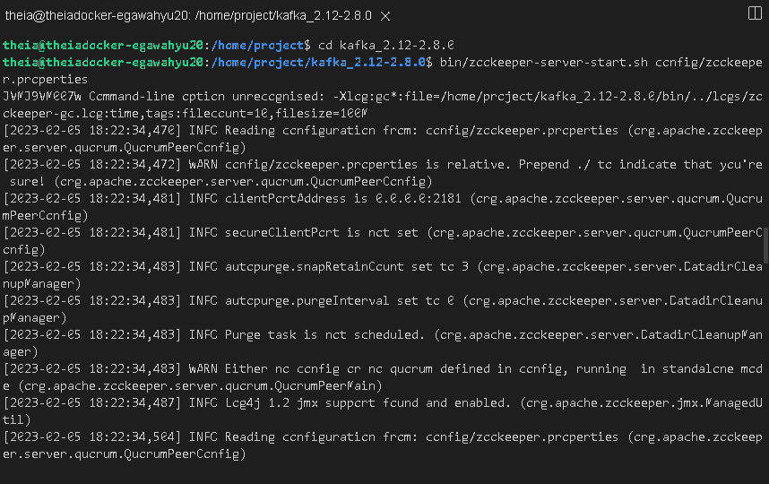
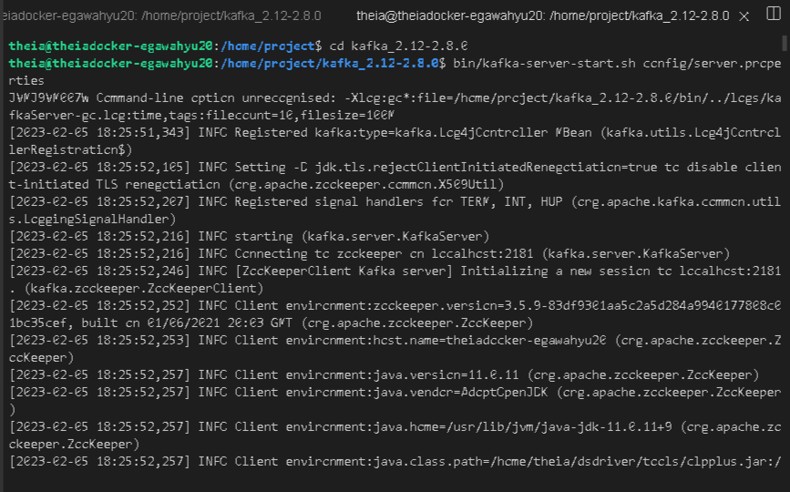
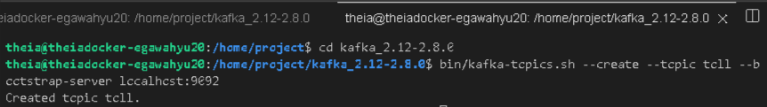
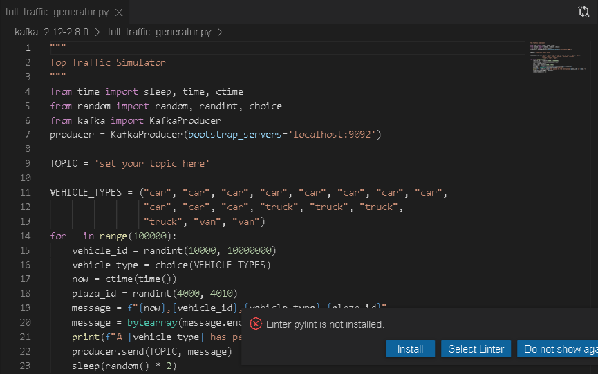
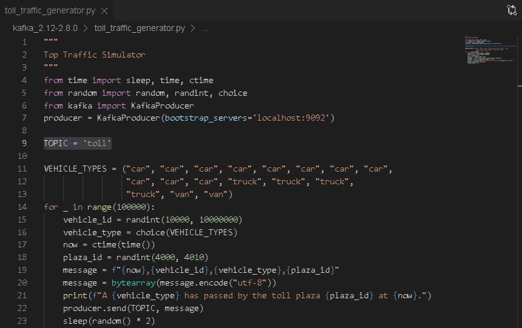
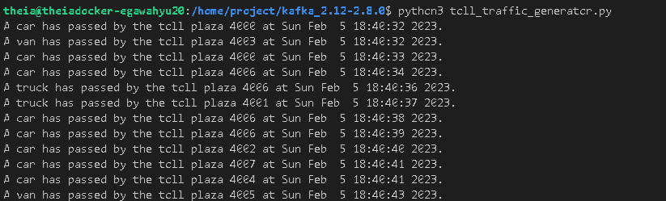
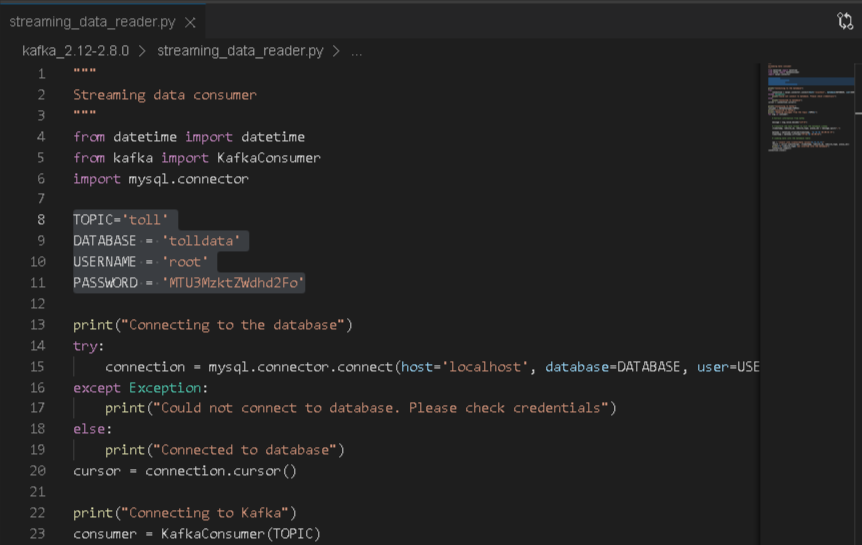
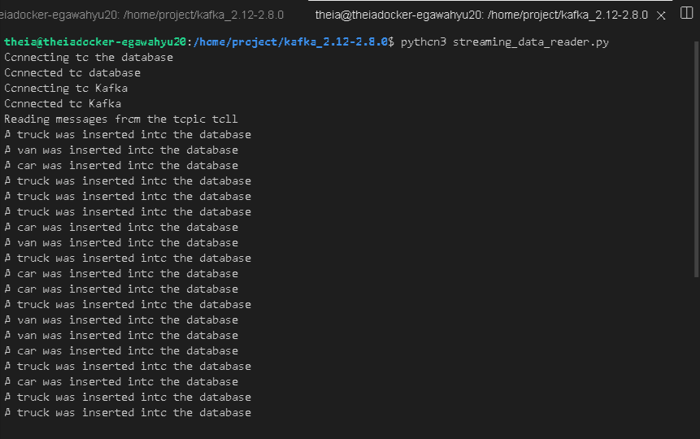
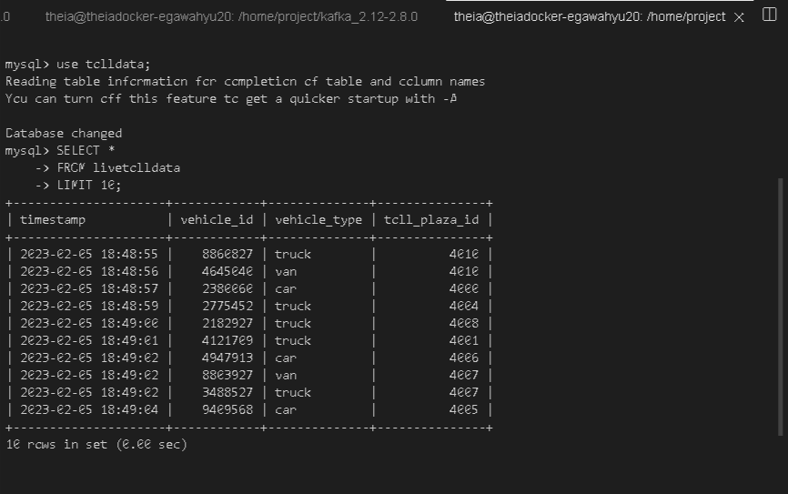

# Scenario
You are a data engineer at a data analytics consulting company. You have been assigned to a project that aims to de-congest the national highways by analyzing the road traffic data from different toll plazas. As a vehicle passes a toll plaza, the vehicle’s data like **vehicle_id**,**vehicle_type**,**toll_plaza_id** and timestamp are streamed to Kafka. Your job is to create a data pipe line that collects the streaming data and loads it into a database.

# Objectives
- Start a MySQL Database server.
- Create a table to hold the toll data.
- Start the Kafka server.
- Install the Kafka python driver.
- Install the MySQL python driver.
- Create a topic named toll in kafka.
- Download streaming data generator program.
- Customize the generator program to steam to toll topic.
- Download and customise streaming data consumer.
- Customize the consumer program to write into a MySQL database table.
- Verify that streamed data is being collected in the database table.

# 1 - Prepare the lab environment

1. Download Kafka.
    ```
    wget https://archive.apache.org/dist/kafka/2.8.0/kafka_2.12-2.8.0.tgz
    ```
2. Extract Kafka.
   ```
   tar -xzf kafka_2.12-2.8.0.tgz
   ```
3. Start MySQL server.
   ```
   start_mysql
   ```
4. Connect to the mysql server, using the command below. Make sure you use the password given to you when the MySQL server starts.
   ```
   mysql --host=127.0.0.1 --port=3306 --user=root --password=(password)
   ```
5. Create a database named **tolldata**.
   ```
   create database tolldata;
   ```
6. Create a table named **livetolldata** with the schema to store the data generated by the traffic simulator.
   ```
   use tolldata;
   create table livetolldata(timestamp datetime,vehicle_id int,vehicle_type char(15),toll_plaza_id smallint);
   ```
7. Disconnect from MySQL server.
8. Install the python module kafka-python using the pip command.
   ```
   python3 -m pip install kafka-python
   ```
9.  Install the python module mysql-connector-python using the pip command.
    ```
    python3 -m pip install mysql-connector-python==8.0.31
    ```

# 2 - Start Kafka
## Task 2.1 - Start Zookeeper
Start zookeeper server.
```
cd kafka_2.12-2.8.0
bin/zookeeper-server-start.sh config/zookeeper.properties
```



## Task 2.2 - Start Kafka server
Start Kafka serversignment

In new terminal
```
cd kafka_2.12-2.8.0
bin/kafka-server-start.sh config/server.properties
```


## Task 2.3 - Create a topic named **toll**
Create a Kakfa topic named toll

In new terminal
```
cd kafka_2.12-2.8.0
bin/kafka-topics.sh --create --topic toll --bootstrap-server localhost:9092
```



## Task 2.4 - Download the Toll Traffic Simulator
Download the toll_traffic_generator.py from [this url](https://cf-courses-data.s3.us.cloud-object-storage.appdomain.cloud/IBM-DB0250EN-SkillsNetwork/labs/Final%20Assignment/toll_traffic_generator.py).

```
wget https://cf-courses-data.s3.us.cloud-object-storage.appdomain.cloud/IBM-DB0250EN-SkillsNetwork/labs/Final%20Assignment/toll_traffic_generator.py
```


## Task 2.5 - Configure the Toll Traffic Simulator
Open the *toll_traffic_generator.py* and set the topic to **toll**.



## Task 2.6 - Run the Toll Traffic Simulator
Run the *toll_traffic_generator.py*.

```
python3 toll_traffic_generator.py
```



## Task 2.7 - Configure

Download the *streaming_data_reader.py* from [this url](https://cf-courses-data.s3.us.cloud-object-storage.appdomain.cloud/IBM-DB0250EN-SkillsNetwork/labs/Final%20Assignment/streaming_data_reader.py).

Open the streaming_data_reader.py and modify the following details so that the program can connect to your mysql server.

- **TOPIC**
- **DATABASE**
- **USERNAME**
- **PASSWORD**



## Task 2.8 - Run
Run the *streaming_data_reader.py*

```
python3 streaming_data_reader.py
```



## Task 2.9 - Health check of the streaming data pipeline.
The streaming toll data would get stored in the table livetolldata.

List the top 10 rows in the table livetolldata.

```
use tolldata;

SELECT *
FROM livetolldata
LIMIT 10;
```
