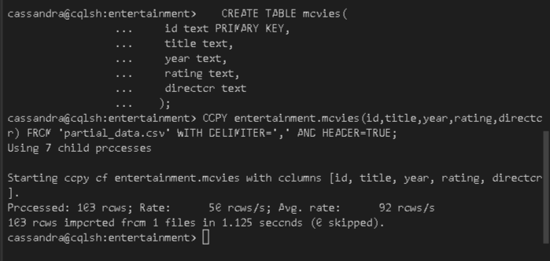
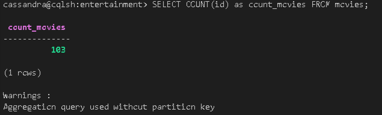
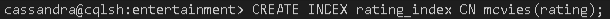
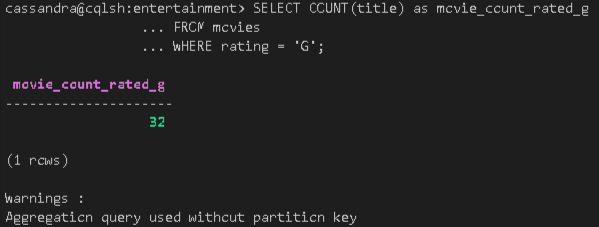
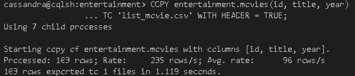

# 4.1 - Import *partial_data.csv* into cassandra server into a keyspace named **entertainment** and a table named **movies**
1. Login to cqlsh
2. Create a keyspace named entertainment
   ```
   CREATE KEYSPACE entertainment  
   WITH replication = {'class':'SimpleStrategy', 'replication_factor' : 3};
   ```
3. Create a collection named movies
   ```
   use entertainment; 
   CREATE TABLE movies(
    id text PRIMARY KEY,
    title text,
    year text,
    rating text,
    director text
   );
   ```
4. Import data
   ```
   COPY entertainment.movies(id,title,year,rating,director) FROM 'partial_data.csv' WITH DELIMITER=',' AND HEADER=TRUE;
   ```

> Note: While creating the table **movies** make the all the columns as text columns including the id column.



# 4.2 - Write a cql query to count the number of rows in the **movies** table
Insert this code below to Cassandra Command Line.
```
SELECT COUNT(id) as count_movies
FROM movies;
```


# 4.3 - Create an index for the **rating** column in the **movies** table using cql
Insert this code below to Cassandra Command Line.
```
CREATE INDEX rating_index ON movies(rating);
```


# 4.4 -  Write a cql query to count the number of movies that are rated **G**.
Insert this code below to Cassandra Command Line;
```
SELECT COUNT(title) as movie_count_rated_g
FROM movies
WHERE rating = 'G';
```


# 4.5 - Export data **id**, **title** and **year** from the **movies** table into a file named *list_movie.csv*
Use this code below to export data from movies table.
```
COPY entertainment.movies(id, title, year)
TO 'list_movie.csv' WITH HEADER = TRUE; 
```
