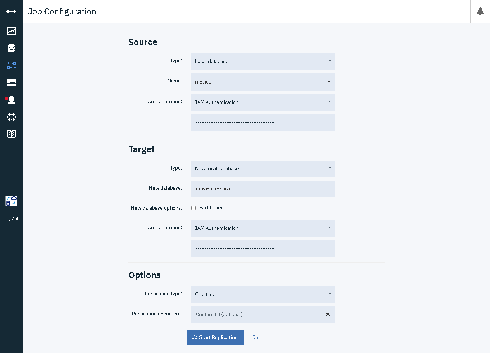

# 2.1 - Replicate a local database into your Cloudant instance
Using the replication page in the Cloudant dashboard, replicate the database using one time replication.


created replicate database should be like this


# 2.2 - Create an index for the **director** key, on the **movies** database using the HTTP API
Use this command on command line to create index for director.
```
curl -X POST $CLOUDANTURL/movies/_index \
-H"Content-Type: application/json" \
-d'{
    "index": {
        "fields": ["Director"]
    }
}'
```


# 2.3 - Write a query to find all movies directed by "Richard Gage" using the HTTP API
Use this command on command line to query.
```
curl -X POST $CLOUDANTURL/movies/_find \
-H"Content-Type: application/json" \
-d'{ "selector":
        {
            "Director":"Richard Gage"
        }
    }'
```


# 2.4 - Create an index for the **title** key, on the **movies** database using the HTTP API
Use this command on command line to create index for title.
```
curl -X POST $CLOUDANTURL/movies/_index \
-H"Content-Type: application/json" \
-d'{
    "index": {
        "fields": ["title"]
    }
}'
```


# 2.5 - Write a query to list only the **year** and **director** keys for the **Top Dog** movies using the HTTP API
Use this command on command line to query.
```
curl -X POST $CLOUDANTURL/movies/_find \
-H"Content-Type: application/json" \
-d'{ "selector":
        {
            "title":"Top Dog"
        },
     "fields": 
        [
            "year",
            "Director"
        ]
    }'
```


# 2.6 - Export the data from the **movies** database into a file named *movies.json*
Use this command on command line to export movies database.
```
couchexport --url $CLOUDANTURL --db movies --type jsonl > movies.json
```
