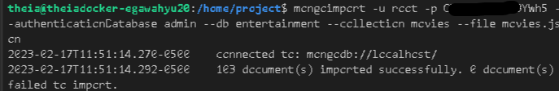
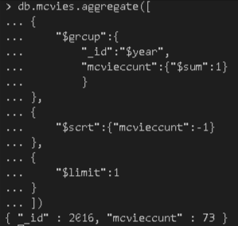
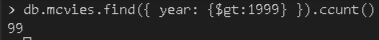
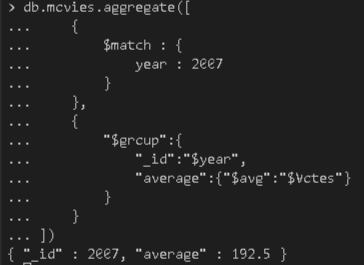
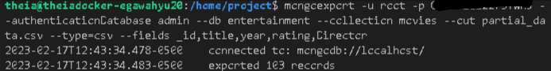

# 3.1 - Import *movies.json* into mongodb server into a database named **entertainment** and a collection named **movies**
to import movies.json we can use this command.
```
mongoimport -u root -p <PASSWORD> --authenticationDatabase admin --db entertainment --collection movies --file movies.json
```
if process succesfull command line should like this.


# 3.2 - Write a mongodb query to find the year in which most number of movies were released
Firstly enter to MongoDB
```
mongo -u root -p <PASSWORD> --authenticationDatabase admin local
```
Use Entertainment database
```
use entertainment
```
Run query use code below
```
db.movies.aggregate([
{
    "$group":{
        "_id":"$year",
        "moviecount":{"$sum":1}
        }
},
{
    "$sort":{"moviecount":-1}
},
{
    "$limit":1
}
])
```


# 3.3 - Write a mongodb query to find the count of movies released after the year 1999
Run query use code below
```
db.movies.find({ year: {$gt:1999} }).count()
```


# 3.4 - Write a query to find out the average votes for movies released in 2007
Run query use code below
```
db.movies.aggregate([ 
    { 
        $match : { 
            year : 2007 
        } 
    },
    {
        "$group":{
            "_id":"$year",
            "average":{"$avg":"$Votes"}
        }
    }   
])
```


# 3.5 - - Export the fields **_id**, **title**, **year**, **rating** and **director** from the **movies** collection into a file named *partial_data.csv*
Use this code below to export data from movies collection with certain fields.
```
mongoexport -u root -p <PASSWORD> --authenticationDatabase admin --db entertainment --collection movies --out partial_data.csv --type=csv --fields _id,title,year,rating,Director
```
