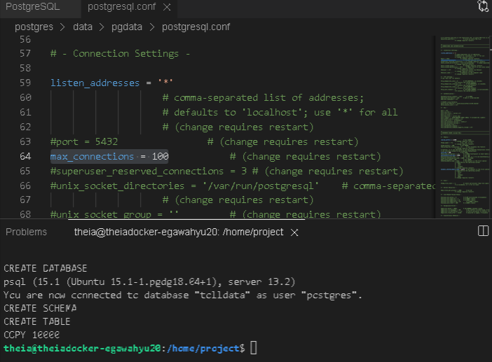
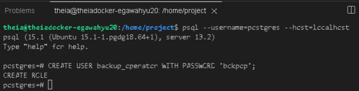
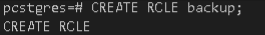
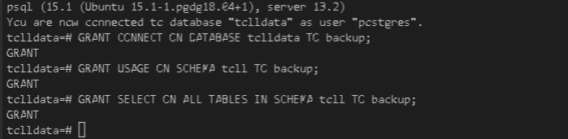
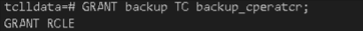
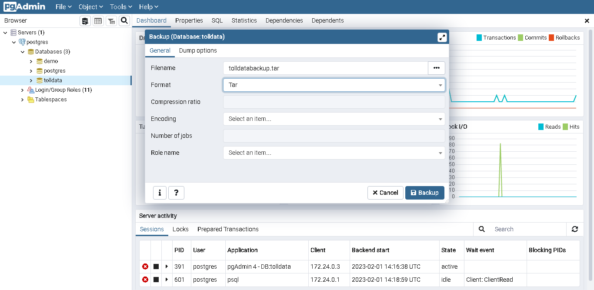

# Scenario
You have assumed the role of database administrator for the PostgreSQL server and you will perform the User Management tasks and handle the backup of the databases.

# Objectives
- Installation/Provisioning
- Configuration
- User Management
- Backup

# 1.1 - Set up the lab environment

- Start the PostgreSQL Server
- Download the lab setup bash file from https://cf-courses-data.s3.us.cloud-object-storage.appdomain.cloud/IBM-DB0231EN-SkillsNetwork/labs/Final%20Assignment/postgres-setup.sh
- Run the bash file

## Task 1.1 - Find the settings in PostgreSQL

What is the maximum number of connections allowed for the postgres server on theia lab?




# 1.2 - User Management

## Task 1.2 - Create a User
Create a user named backup_operator.

```
CREATE USER backup_operator WITH PASSWORD 'bckpop';
```


## Task 1.3 - Create a Role
Create a role named backup.
```
CREATE ROLE backup;
```


## Task 1.4 - Grant privileges to the role
Grant the following privileges to the backup role.

- CONNECT ON tolldata DATABASE.
- SELECT ON ALL TABLES IN SCHEMA toll.

```
GRANT CONNECT ON DATABASE tolldata TO backup;
GRANT USAGE ON SCHEMA toll TO backup;
GRANT SELECT ON ALL TABLES IN SCHEMA toll TO backup;
```



## Task 1.5 - Grant role to an user
Grant the role backup to backup_operator
```
GRANT backup TO backup_operator;
```


# 1.3 - Backup
## Task 1.6 - Backup a database on PostgreSQL server
Backup the database tolldata using PGADMIN GUI.

Backup the database tolldata into a file named tolldatabackup.tar, select the backup format as Tar
