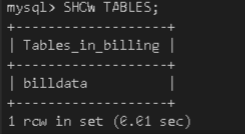
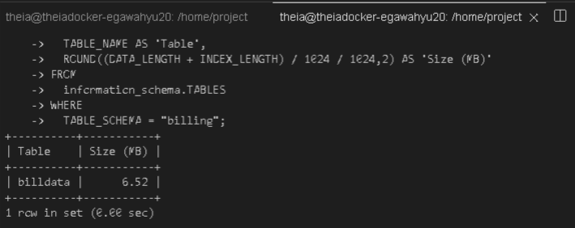
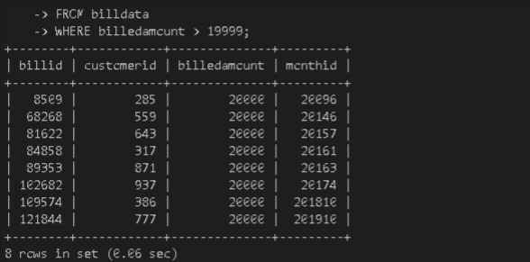
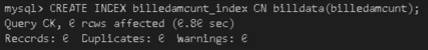
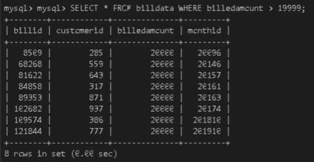
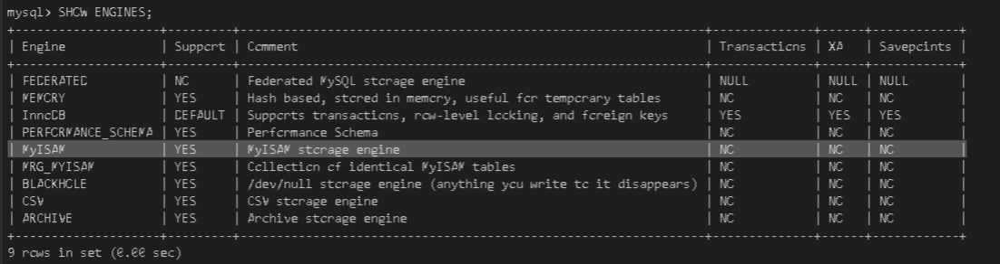
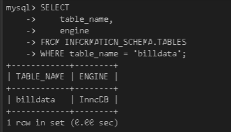
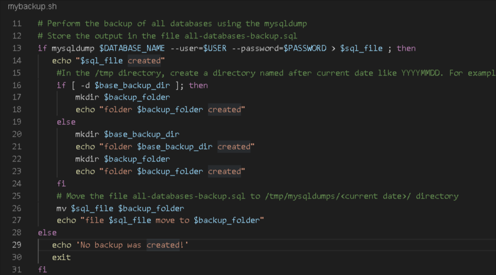

# Scenario
You have assumed the role of database administrator for the MySQL server and will perform the tasks like configuration check, recovery of data. You will use indexing to improve the database performance. You will identify which storage engines are supported by the server and which table uses which storage engine. Optionally You will also automate backup tasks.

# Objectives
- Installing/Provisioning
- Configuration
- Recovery
- Indexing
- Storage Engines
- Automation of routine tasks

# 2.1 - Set up the lab environment

- Start the MySQL Server
- Download the backup file https://cf-courses-data.s3.us.cloud-object-storage.appdomain.cloud/IBM-DB0231EN-SkillsNetwork/labs/Final%20Assignment/billingdata.sql


# 2.2 - Recovery

## Task 2.1 - Restore MySQL server using a previous backup
Restore this file onto MySQL server.

List the tables in the billing database.

```
SOURCE billingdata.sql;
```
```
USE billing;
SHOW TABLES;
```



## Task 2.2 - Find the table data size
Find the data size of the table billdata.
```
SELECT
  TABLE_NAME AS 'Table',
  ROUND((DATA_LENGTH + INDEX_LENGTH) / 1024 / 1024,2) AS 'Size (MB)'
FROM
  information_schema.TABLES
WHERE
  TABLE_SCHEMA = "billing";
```


# 2.3 - Indexing
## Task 2.3 - Baseline query performance
Write a query to select all rows with a billedamount > 19999 in table billdata.

```
SELECT *
FROM billdata
WHERE billedamount > 19999;
```



## Task 2.4 - Create an index
Your customer wants to improve the execution time of the query you wrote in Task 2.3.

Create an appropriate index to make it run faster.
```
CREATE INDEX billedamount_index ON billdata(billedamount);
```


## Task 2.5 - Document the improvement in query performance
Find out if the index has any impact on query performance.

Re-run the baseline query of Task 2.3 after creating the index.
```
SELECT *
FROM billdata
WHERE billedamount > 19999;
```


# 2.4 - Storage Engines
## Task 2.6 - Find supported storage engines
Run a command to find out if your MySQL server supports the MyISAM storage engine.
```
SHOW ENGINES;
```


## Task 2.7 - Find the storage engine of a table
Find the storage engine of the table billdata.

```
    SELECT 
        table_name, 
        engine 
    FROM INFORMATION_SCHEMA.TABLES 
    WHERE table_name = 'billdata';
```


# 2.5 - Automation of routine tasks
## Task 2.8 - Write a bash script that performs a backup of all the databases
Write a bash script named mybackup.shthat performs the following tasks.

- Perform the backup of all databases using the mysqldump
- Store the output in the file all-databases-backup.sql
- In the /tmp directory, create a directory named after current date like YYYYMMDD. For example, 20210830
- Move the file all-databases-backup.sql to /tmp/mysqldumps/(current date)/ directory



File : [mybackup.sh](mybackup.sh)