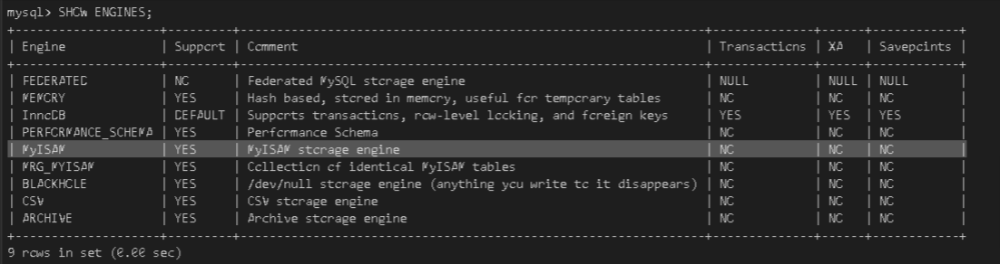
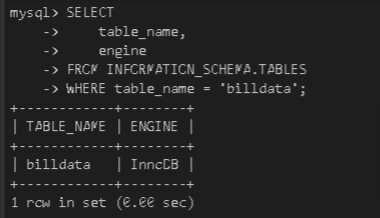

# Scenario
You have been assigned the work to provison a cloud instance of IBM DB2 server and perform the tasks like restoration of data, index creation to improve the query performance. You will create views to make queries easier to write. Optionally You will also connect to the cloud instance of IBM DB2 server and from command line.

# Objectives
- Restore data
- Indexing
- View creation
- Connecting from command line

# 3.1 - Prepare the lab environment

- Access to a cloud instance of IBM DB2 database.
- Download the file [billing.csv](Assets/billing.csv)


# 3.2 - Restore data

## Task 3.1 - Restore the table billing
Use the billing.csv you have downloaded earlier, restore the csv file into a table named billing.
>Note: You will see that each column has data type and column width auto generated based on the content. Edit column attributes by clicking on the pencil icon next to the respective attributes to change the width of country column to varchar of 30 and month column to varchar of 7.


# 3.3 - Create a view
## Task 3.2 - Create a view named basicbilldetailswith the columns customerid, month, billedamount
```
CREATE VIEW basicbilldetails AS
SELECT "CUSTOMERID", "MONTH", "BILLEDAMOUNT"
FROM "XLQ93763"."BILLING";
```


# 3.4 - Indexing
## Task 3.3 - Baseline query performance
Write a query to find out all the rows with a billing amount of 19929.

```
SELECT *
FROM billing
WHERE billedamount > 19929;
```


## Task 3.4 - Create an index
Create an index that can make the query in the previous task faster. Name the index as billingamount.
```
CREATE INDEX billingamount ON BILLING(billedamount);
```


## Task 3.5 - Document the improvement in query performance
Find out if the index has any impact on query performance.

Re-run the query to find out all the rows with a billing amount of 19929.


# 2.4 - Storage Engines
## Task 2.6 - Find supported storage engines
Run a command to find out if your MySQL server supports the MyISAM storage engine.
```
SHOW ENGINES;
```


## Task 2.7 - Find the storage engine of a table
Find the storage engine of the table billdata.

```
    SELECT 
        table_name, 
        engine 
    FROM INFORMATION_SCHEMA.TABLES 
    WHERE table_name = 'billdata';
```


# 2.5 - Automation of routine tasks
## Task 2.8 - Write a bash script that performs a backup of all the databases
Write a bash script named mybackup.shthat performs the following tasks.

- Perform the backup of all databases using the mysqldump
- Store the output in the file all-databases-backup.sql
- In the /tmp directory, create a directory named after current date like YYYYMMDD. For example, 20210830
- Move the file all-databases-backup.sql to /tmp/mysqldumps/(current date)/ directory


File : [mybackup.sh](mybackup.sh)